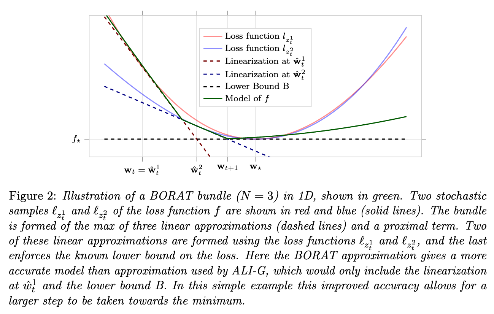

# BORAT
This is the pytorch implementation of our work [A Stochastic Bundle Method for Interpolating Networks](https://arxiv.org/pdf/2201.12678.pdf) publish in JMLR issue 20. If this code is useful please cite as:

```

@Article{paren2022stochastic,
  author       = {Paren, Alasdair and Berrada, Leonard and Poudel, Rudra PK and Kumar, M Pawan},
  title        = {A Stochastic Bundle Method for Interpolating Networks},
  journal      = {Journal of Machine Learning Research},
  pages        = {1--57},
  volume       = {23},
  year         = {2022},
}

```


# Abstract

We propose a novel method for training deep neural networks that are capable of interpola-
tion, that is, driving the empirical loss to zero. At each iteration, our method constructs a
stochastic approximation of the learning objective. The approximation, known as a bundle,
is a pointwise maximum of linear functions. Our bundle contains a constant function that
lower bounds the empirical loss. This enables us to compute an automatic adaptive learning
rate, thereby providing an accurate solution. In addition, our bundle includes linear approx-
imations computed at the current iterate and other linear estimates of the DNN parameters.
The use of these additional approximations makes our method significantly more robust
to its hyperparameters. Based on its desirable empirical properties, we term our method
Bundle Optimisation for Robust and Accurate Training (BORAT). In order to operationalise
BORAT, we design a novel algorithm for optimising the bundle approximation efficiently
at each iteration. We establish the theoretical convergence of BORAT in both convex and
non-convex settings. Using standard publicly available data sets, we provide a thorough
comparison of BORAT to other single hyperparameter optimisation algorithms. Our exper-
iments demonstrate BORAT matches the state-of-the-art generalisation performance for
these methods and is the most robust.

# Primal Problem

At each time BORAT forms uses a bundle of size N to approimate the loss:


or viewed pictorially:




# Code Requirements and Installation

This code should work for PyTorch >= 1.0 in python3. Please install the necessary packages using:

```
install -r requirements.txt
```

# Usage

```python
import torch
from borat import BORAT

# boilerplate code:
# `model` is a nn.Module
# `x` is an input sample, `y` is a label

# BORAT uses a contraint based regularization:
def l2_projection(parameters, max_norm):
    total_norm = torch.sqrt(sum(p.norm() ** 2 for p in parameters))
    if total_norm > max_norm:
        ratio = max_norm / total_norm
        for p in parameters:
            p *= ratio

# create BORAT optimizer with maximal learning-rate of 0.1
optimizer = BORAT(parameters, model, loss, eta=0.1, n=3, momentum=0.9,
                         projection_fn=lambda: l2_projection(parameters, args.max_norm))

# BORAT can be used with standard pytorch syntax
optimizer.zero_grad()
loss = torch.nn.functional.cross_entropy(model(x), y)
loss.backward()

# Note: BORAT needs to have access to the current loss value and batch of data

optimizer.step(lambda: float(loss_value), x, y)

# Note: BORAT only perform an update even N-1 steps

if optimizer.n == 0:
    # update metrics here
```

# Technical Requirements for Applicability

BORAT similar to the earlier ALI-G algorithm exploits the interpolation property to compute a step-size. This induces the following two requirements for its applicability:

The model should be able to achieve a loss of zero on all training samples (typically in the order of 0.01 or less).
If there is regularization, it should be expressed as a constraint (see example above).

# Reproducing the Results

The following command lines assume that the current working directory is experiments.

```
reproduce/run_no_wait_GPU.py
```

```
python main.py --model wrn --dataset cifar100 --batch_size 128 --opt borat --eta 0.01 --max_norm 50 --loss ce --tag test --epochs 200 --depth 40 --width 4
```

# Acknowledgments

this code base is based of that found at https://github.com/oval-group/ali-g


