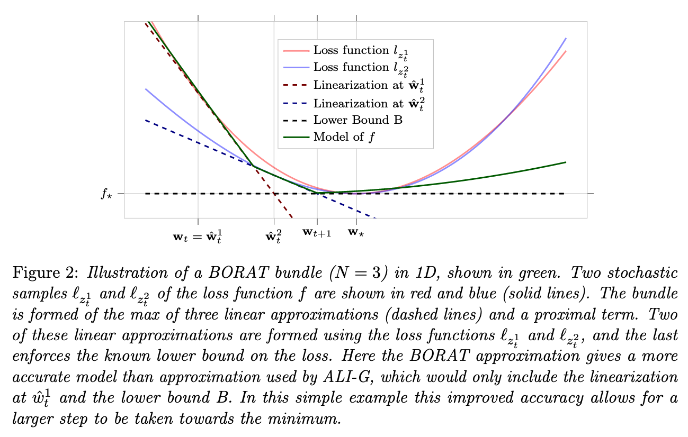

# BORAT
This is the pytorch implementation of our work [A Stochastic Bundle Method for Interpolating Networks](https://arxiv.org/pdf/2201.12678.pdf) publish in JMLR issue 20.

# Abstract

We propose a novel method for training deep neural networks that are capable of interpola-
tion, that is, driving the empirical loss to zero. At each iteration, our method constructs a
stochastic approximation of the learning objective. The approximation, known as a bundle,
is a pointwise maximum of linear functions. Our bundle contains a constant function that
lower bounds the empirical loss. This enables us to compute an automatic adaptive learning
rate, thereby providing an accurate solution. In addition, our bundle includes linear approx-
imations computed at the current iterate and other linear estimates of the DNN parameters.
The use of these additional approximations makes our method significantly more robust
to its hyperparameters. Based on its desirable empirical properties, we term our method
Bundle Optimisation for Robust and Accurate Training (BORAT). In order to operationalise
BORAT, we design a novel algorithm for optimising the bundle approximation efficiently
at each iteration. We establish the theoretical convergence of BORAT in both convex and
non-convex settings. Using standard publicly available data sets, we provide a thorough
comparison of BORAT to other single hyperparameter optimisation algorithms. Our exper-
iments demonstrate BORAT matches the state-of-the-art generalisation performance for
these methods and is the most robust.

